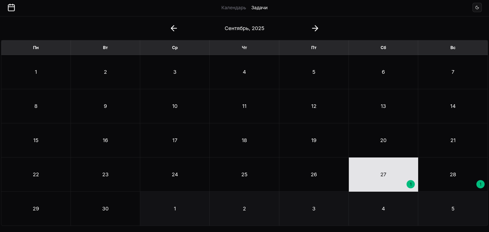

# Tasks-Calendar

_Vite + React + TS + TailwindCSS + ShadcnUI_

Простенькое полностью клиентское приложение для контроля задач с календарем.



## Использование:

```bash
git clone https://github.com/atrocityz/tasks-calendar
cd ./tasks-calendar
yarn install
```

> Этот проект включает в себя несколько веток с различными реализациями (например, использование разных стейт менеджеров).

## Затронуты такие вещи как:

- Работа с формами через библиотеку [react-hook-form](https://react-hook-form.com/)
- Работа с глобальным state менеджером (main ветка - [zustand](https://zustand.docs.pmnd.rs/), stores/mobx ветка - [mobx](https://mobx.js.org/README.html), stores/effector ветка - [effector](https://effector.dev/))
- Работа с датами через библиотеку [date-fns](https://date-fns.org/)
- Темизация (светлая/темная) через [shadcn](https://ui.shadcn.com/)
- Архитектура компонентов через контейнеризацию для отделения логики и отображения
